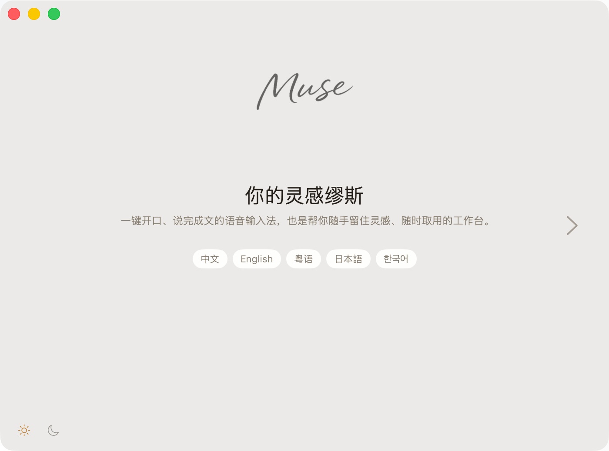
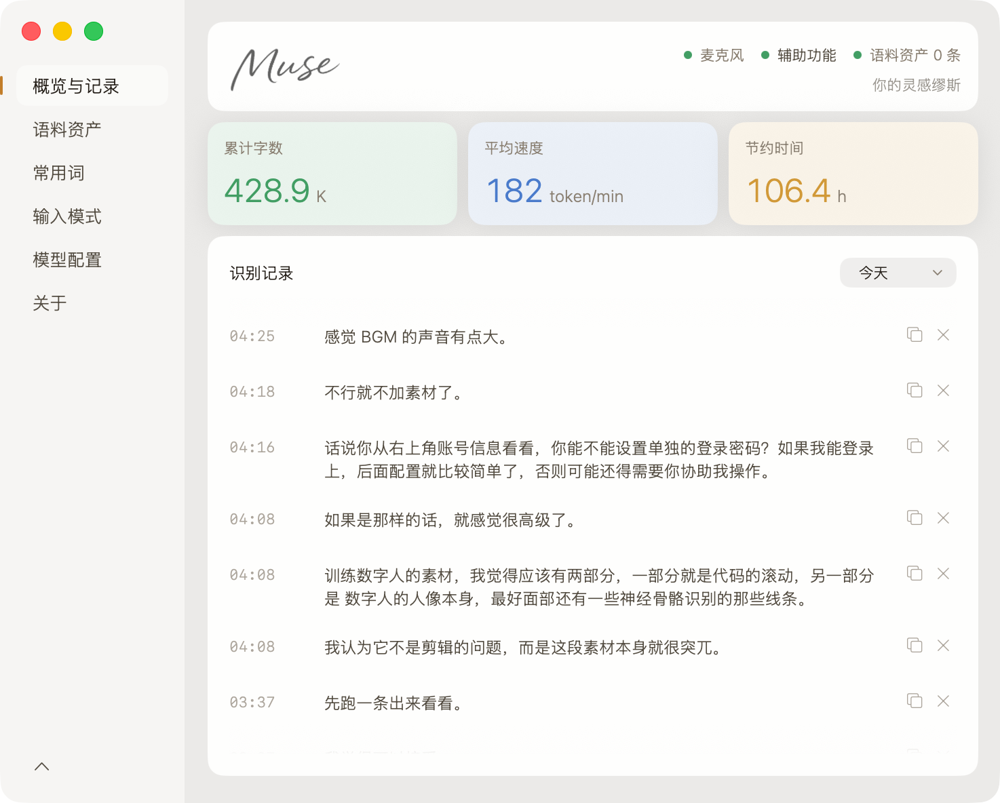
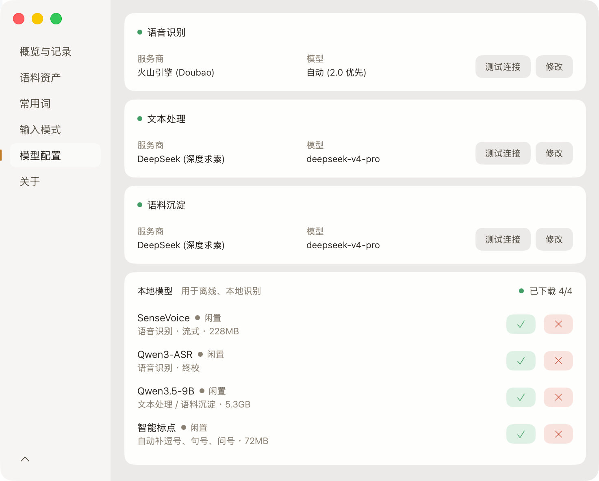

<p align="center">
  
</p>

<h3 align="center">轻量、好用的 macOS 原生语音输入法</h3>

## 当前版本开发目标

2026-09-21 确认：基础语音输入为 **直出** 与 **润色**；润色一次完成口误修正和结构化排版，同时保留英文翻译、提示词优化、命令与自定义模式。

轻度润色兼顾速度与准确性，快速修正口误、错词等小问题；标准润色在纠错和保留原意的基础上整理内容结构。润色能力已由用户验收。完整行为边界见[产品需求](docs/2026-08-17-Muse-Voice-Polish-Product-Requirements.md)。

设置分为 **概览与记录、输出模式、我的词库、模型配置、关于**。输出模式上半编辑提示词，下半对照测试，右上设置快捷键与录音方式。词汇纠错与固定替换统一管理，自动记词集中在词库页。

## 产品展示

以下截图展示使用引导与概览。

<p align="center">
  
</p>

<p align="center">
  
</p>

## 核心能力

- **语音输入**：全局快捷键触发，识别结果自动注入当前输入框。
- **多种识别引擎**：Apple 端侧识别、火山引擎与阿里云百炼流式识别，以及 SenseVoice + Qwen3-ASR 本地离线识别。
- **AI 文本处理**：支持直出、润色、Prompt 优化、翻译和自定义处理模式。
- **我的词库**：统一管理“原文字 → 替换内容”；适合的短词同时用于识别增强，可选择自动记住润色上屏后的明确纠正。
- **概览与记录**：查看输入统计，保留原始文本和处理结果。
- **本地模型管理**：在应用内查看 SenseVoice、Qwen3-ASR、本地 LLM 和智能标点组件的状态。

## 产品界面

### 模型配置

<p align="center">
  
</p>

## 使用方式

1. 首次启动时授予麦克风和辅助功能权限。
2. 在「模型配置」中选择语音识别与文本处理服务。
3. Muse 完成识别和处理后，将文字直接写入当前光标位置。

快捷键、触发方式和文本处理模式均可在设置中调整。

## 引擎选择

| 方案 | 识别音频是否上传 | 适用场景 | 额外配置 |
|---|---|---|---|
| Apple 端侧识别 | 否（强制端侧；不支持的语言会报错） | 零配置快速开始 | 无 |
| 火山引擎 | 是 | 云端高精度流式识别 | API 凭据 |
| 阿里云百炼 Fun-ASR / Paraformer | 是 | 可切换云端多语种流式模型；双模型自动同步本地热词（权重 5） | API Key；Workspace ID 可选 |
| SenseVoice + Qwen3-ASR | 否 | Apple Silicon 本地离线识别 | 下载本地模型 |

文本处理支持云端 LLM、Ollama 和 Muse 本地模型。轻度与标准共用已选择的文本处理 Provider 和模型；可共用同 Provider 下的语音润色专用模型名称设置。直出不调用润色模型，管线不暗中切换模型。

## 系统要求

- macOS 14 Sonoma 或更高版本
- 麦克风权限
- 辅助功能权限，用于全局快捷键和文字注入
- 本地 Qwen3-ASR 与本地 LLM 需要 Apple Silicon

## 从源码构建

项目使用 Swift Package Manager，不包含 `.xcodeproj`。

```bash
swift build
swift test
swift build -c release
```

打包和本机运行：

```bash
bash scripts/package-app.sh
bash scripts/build_and_run.sh --verify
```

本地识别服务位于 `sensevoice-server/` 和 `qwen3-asr-server/`，相关构建脚本位于 `scripts/`。

## 项目结构

| 路径 | 内容 |
|---|---|
| `Muse/` | macOS 应用、识别、文本处理、数据和界面代码 |
| `MuseTests/` | 单元测试与集成测试 |
| `sensevoice-server/` | SenseVoice 本地流式识别服务 |
| `qwen3-asr-server/` | Qwen3-ASR 本地终校服务 |
| `scripts/` | 构建、打包、部署和健康检查脚本 |

## 版权

Copyright (c) 2026 DaliangPro. All rights reserved.

本项目为专有软件。未经 DaliangPro 事先书面许可，不得使用、复制、修改、分发、
再许可或销售本项目及其源码。详见 [LICENSE](LICENSE)。
