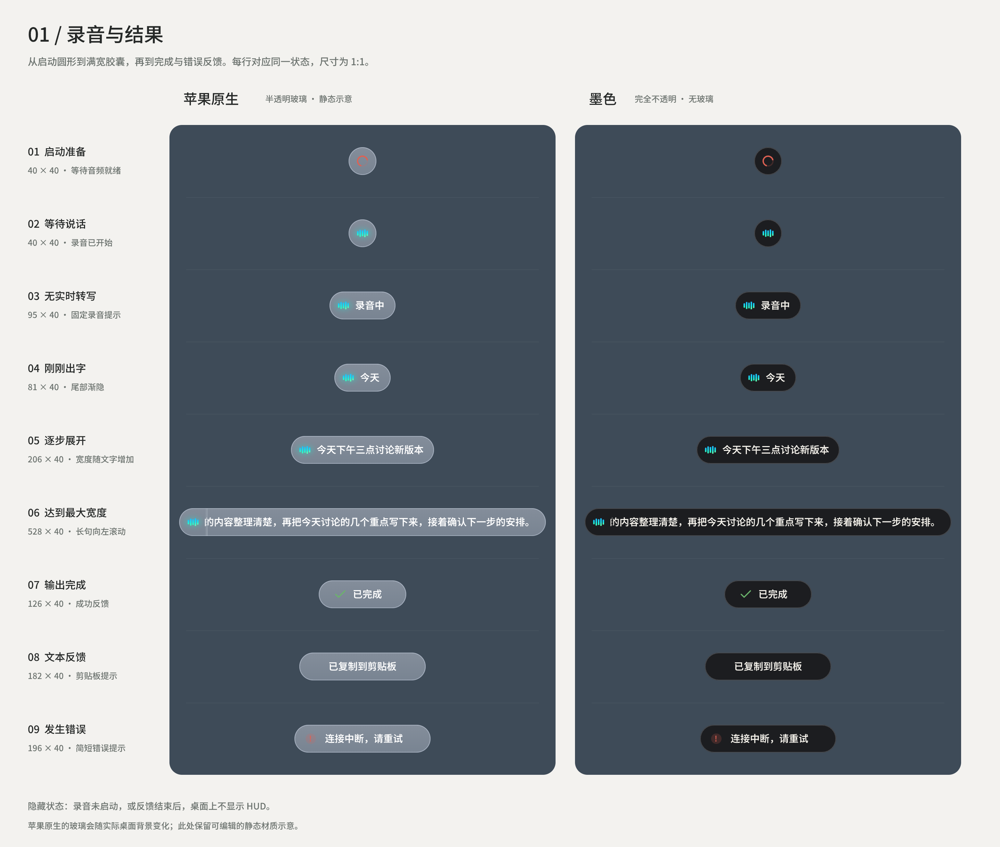
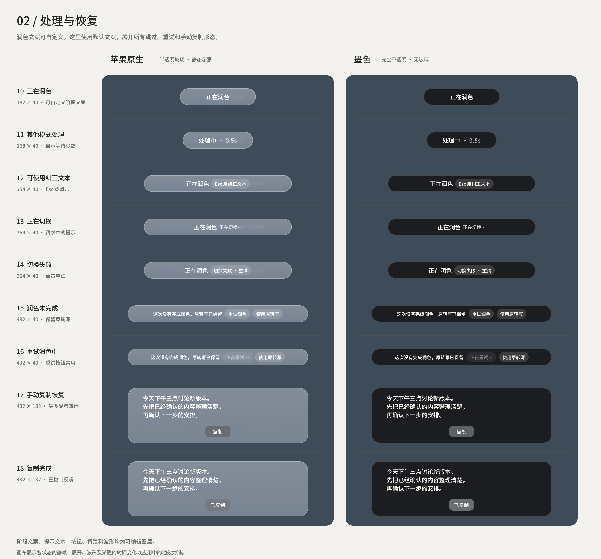
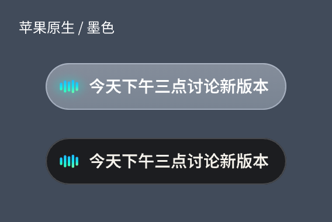

# Muse HUD 设计

[打开 Pen 全形态源文件](2026-09-22-Muse-HUD-全形态.pen)。文件包含苹果原生、墨色两款样式的录音、处理、结果与恢复状态。

两款共用40pt高度、蓝绿波形及布局：文字从左侧37pt处开始，尾字后保留12pt渐隐与4pt外侧空白，最大宽度528pt。应用中的文字、渐隐与外壳共用同一帧的动画进度。

设计图展示静态布局；原生玻璃会随实际桌面背景变化。

